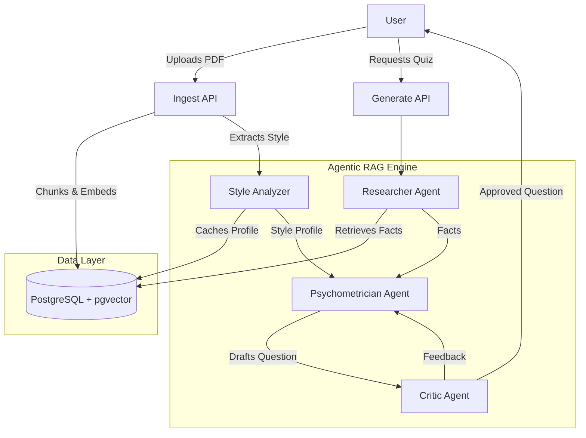

# GenCertQuiz

A RAG-powered certification quiz generator that uses a **Multi-Agent AI System** to ingest textbooks and generate high-quality, exam-style questions.

## 🚀 Key Features

- **🤖 Multi-Agent RAG Pipeline**
  - **Researcher Agent**: Extracts core facts and definitions from uploaded textbooks.
  - **Style Analyzer**: Analyzes uploaded exam papers to extract question patterns, difficulty, and tone.
  - **Psychometrician Agent**: Drafts questions that combine factual accuracy with exam-style formatting.
  - **Critic Agent**: Reviews and refines questions to ensure quality and remove hallucinations.

- **📚 Content Management**
  - **PDF Ingestion**: Upload textbooks and exam papers (text & vision analysis).
  - **File Management**: View and delete uploaded files.
  - **Vector Search**: Semantic retrieval using `pgvector`.

- **📝 Interactive Quiz**
  - Generate quizzes with adjustable difficulty.
  - Real-time feedback and explanations.

## 🛠️ Tech Stack

- **Backend**: FastAPI, Python 3.11+, Pydantic AI Agents
- **AI/ML**: OpenAI GPT-4o, Anthropic Claude 3.5 Sonnet
- **Database**: PostgreSQL with `pgvector`
- **Frontend**: Next.js 14, React, Tailwind CSS, Lucide Icons
- **Infrastructure**: Docker Compose

## 🏗️ Architecture



## ⚡ Quick Start

### Prerequisites
- Docker Desktop
- Python 3.11+
- Node.js 18+
- OpenAI API Key

### 1. Start Infrastructure
```bash
docker-compose up -d
```

### 2. Backend Setup
```bash
cd backend
python -m venv .venv
source .venv/bin/activate  # Windows: .venv\Scripts\activate
pip install -r requirements.txt
cp .env.example .env  # Add your API keys
python main.py
```

### 3. Frontend Setup
```bash
cd frontend
npm install
npm run dev
```

Visit:
- Frontend: http://localhost:3000
- Backend Docs: http://localhost:8000/docs
