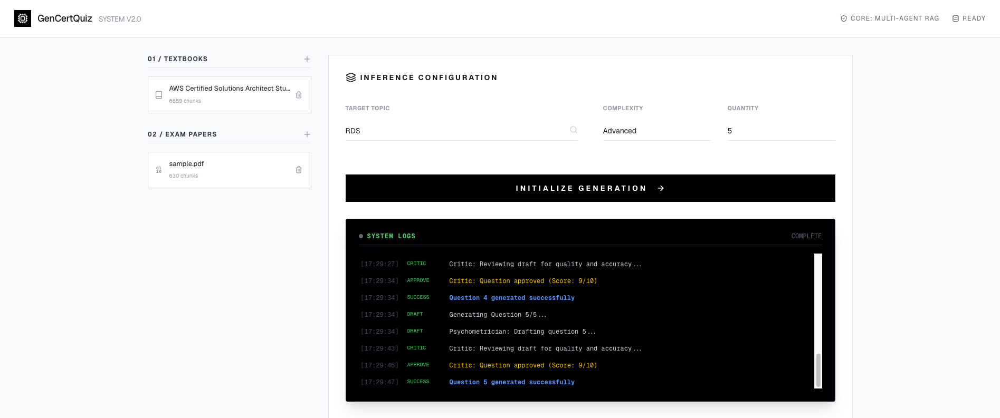
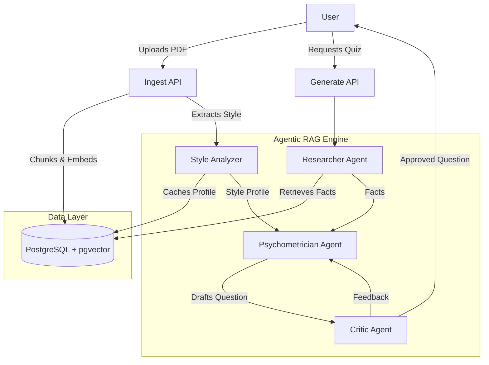

# 🎓 GenCertQuiz: Transform Textbooks into Professional Exams with Multi-Agent AI

[](https://opensource.org/licenses/MIT)
[](https://www.python.org/downloads/)
[](https://www.docker.com/)

> **Don't just read the textbook—master it.** GenCertQuiz uses a sophisticated RAG-powered Multi-Agent system to analyze your study materials and generate high-quality, exam-style quizzes that mimic real certification standards.

## 🌟 Why GenCertQuiz?
Most AI quiz generators just rephrase text. GenCertQuiz acts like a professional exam board:
- **The Researcher** deep-dives into facts.
- **The Style Analyzer** mimics the tone of specific exams (e.g., AWS SAA-C03).
- **The Critic** ensures no hallucinations and high academic rigor.

<div align="center">
  
</div>

## 🚀 Key Features

- **🤖 Multi-Agent RAG Pipeline**
  - **Researcher Agent**: Extracts core facts and definitions from uploaded textbooks.
  - **Style Analyzer**: Analyzes uploaded exam papers to extract question patterns, difficulty, and tone.
  - **Psychometrician Agent**: Drafts questions that combine factual accuracy with exam-style formatting.
  - **Critic Agent**: Reviews and refines questions to ensure quality and remove hallucinations.

- **📚 Content Management**
  - **PDF Ingestion**: Upload textbooks and exam papers (text & vision analysis).
  - **File Management**: View and delete uploaded files.
  - **Vector Search**: Semantic retrieval using `pgvector`.

- **📝 Interactive Quiz**
  - Generate quizzes with adjustable difficulty.
  - Real-time feedback and explanations.

## 🛠️ Tech Stack

- **Backend**: FastAPI, Python 3.11+, Pydantic AI Agents
- **AI/ML**: OpenAI GPT-4o, Anthropic Claude 3.5 Sonnet
- **Database**: PostgreSQL with `pgvector`
- **Frontend**: Next.js 14, React, Tailwind CSS, Lucide Icons
- **Infrastructure**: Docker Compose

## 🏗️ Architecture



## ⚡ Quick Start (Docker)

The easiest way to run the application is using Docker Compose, which handles the frontend, backend, and database.

### Prerequisites
- Docker & Docker Compose
- API Keys (OpenAI, Anthropic)

### 1. Configure Environment
Create a `.env` file in the `backend/` directory (or rely on the default `docker-compose.yml` mapping):

```bash
# Copy example env in backend
cp backend/.env.example backend/.env
# Edit backend/.env to add your API keys
```

### 2. Run with Docker Compose
```bash
docker-compose up --build
```

Access the application:
- **Frontend**: http://localhost:3000
- **Backend API Docs**: http://localhost:8000/docs

---

## 🛠️ Development Setup (Manual)

If you want to run services individually for development:

### 1. Database
```bash
docker-compose up -d db
```

### 2. Backend
```bash
cd backend
python3 -m venv .venv
source .venv/bin/activate
pip install -e .
cp .env.example .env  # Add your API keys
uvicorn main:app --reload --port 8000
```

### 3. Frontend
```bash
cd frontend
npm install
npm run dev
```
